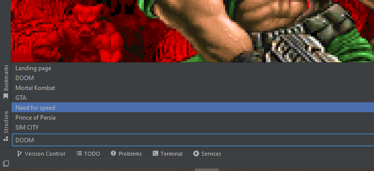

IntelliJ plugin DOOM
---

<!-- Plugin description -->
This [IntelliJ IDEA](https://www.jetbrains.com/idea/) plugin allows users to play DOOM and other retro DoS games inside an IntelliJ tool-window.
This plugin uses [js-dos](https://github.com/caiiiycuk/js-dos) and games are hosted on [DoS Zone](https://dos.zone/).

## Supported Games
- DOOM
- Mortal Kombat
- Grand Theft Auto
- Prince of Persia
- Sim City
- Need For Speed

Select games using the combo box below the tool window.

Also [check out](https://github.com/KOTerra/oxygen-addon-doom) this plugin's implementation for [Oxygen XML editor](https://www.oxygenxml.com/).

<!-- Plugin description end -->
